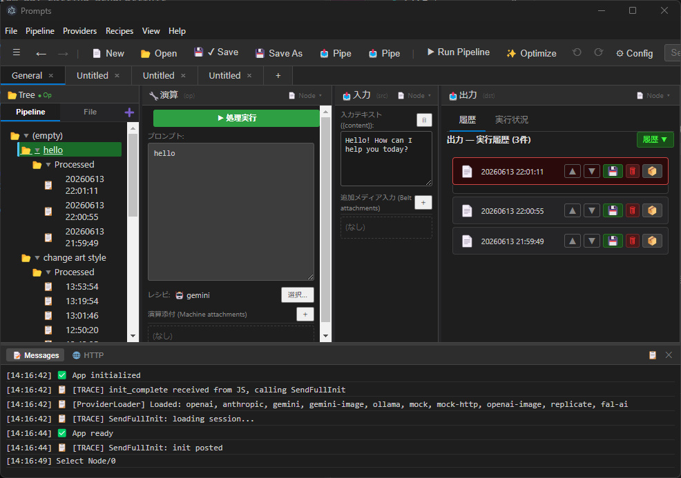

<div align="center">


# Wend

### The visual IDE for building, running & orchestrating AI pipelines — powered by Behavior Trees.

Stop wrangling prompts in scattered text files. **Design prompt pipelines as visual node trees, run them as Behavior Trees, and let Claude orchestrate the whole thing through MCP.**

[](COPYING.txt)
[](#getting-started)
[](https://www.electronjs.org/)
[](#-let-claude-drive-mcp-server)
[](#-contributing)
[](https://github.com/gadget114514/Wend/stargazers)

[**Quick Start**](#-getting-started) · [**Why Wend?**](#-why-prompts) · [**Behavior Trees**](#-behavior-trees-for-llms) · [**MCP Server**](#-let-claude-drive-mcp-server) · [**Roadmap**](#-roadmap)



</div>

---

## ⭐ Why Wend?

### Do you really need AI for repetitive work?

A lot of practical AI use cases are not creative — they're repetitive. Summarize 200 documents. Translate a product catalog. Screen 500 resumes. Extract structured data from a pile of PDFs. For this kind of work, **the AI is the worker, not the manager.** What you actually need is a way to define the job and run it reliably.

You could write a script. But then you're back to writing code every time the task changes. You could just prompt an AI to "figure it out" — but then you lose control over what it actually does, and debugging a failure means reading through walls of chat history.

**There's a better middle ground: give the AI a clear structure to work within, and let it fill in the content.**

### Why not just have an AI control other AIs?

This works for open-ended exploration. But for production workflows — things you run every day, on real data, where failures cost time or money — you need more:

- **Predictability** — the same input should produce the same execution path, not a different interpretation each time
- **Debuggability** — when something fails, you need to know exactly which step failed and why, not reconstruct it from LLM logs
- **Cost control** — routing every decision through an LLM when simple logic would do wastes money
- **Fallbacks you can trust** — retry on failure, skip bad inputs, fall back to a cheaper model: these should be defined by you, not improvised by the AI

### Why a control structure — and why Behavior Trees?

Once you accept that a control structure helps, the question is which one. A few options:

| Approach | Problem |
|---|---|
| **Hardcoded script** | Rigid. Every change requires a developer. |
| **State machine (FSM)** | Good for fixed flows, but can't express branching and retry cleanly at scale. |
| **Workflow DAG** (Airflow-style) | Great for data pipelines, but awkward for conditional logic and nested loops. |
| **Pure LLM agent** | Flexible, but unpredictable, expensive, and hard to debug. |
| **Behavior Tree** | ✅ Composable, visual, handles branching and retry naturally, runs deterministically. |

Behavior Trees were developed in game AI to control characters with hundreds of possible actions — exactly the kind of complex-but-structured decision-making that AI pipelines need. They compose well, fail gracefully, and can be read and edited without writing code.

**Wend brings Behavior Trees to AI pipelines** — a local-first visual IDE where you design the structure and the AI does the work.

---

Most "prompt tools" are either a single chat box or a cloud SaaS that wants your API keys. **Wend is different** — it's a local-first desktop IDE that treats prompt engineering like real engineering:

| | |
|---|---|
| 🌳 **Behavior Trees, not spaghetti** | Borrow battle-tested control flow from game AI. Compose prompts with `sequence`, `selector`, `parallel`, decorators, and loops — no glue code. |
| 🤖 **Let Claude drive** | A built-in **MCP server with 29 tools** lets Claude (or any MCP client) create, run, and parallelize your pipelines autonomously. |
| ⚡ **Real parallelism** | `map` over inputs, `race` for the first good answer, `join` a fan-out, `reduce` results with code *or* AI. |
| 🔌 **Bring any model** | OpenAI, Google Gemini, Anthropic Claude, or **any** OpenAI-compatible endpoint. Mix providers in one pipeline. |
| 🔒 **Your keys never leave your machine** | Everything runs locally. API keys live in `%APPDATA%`, never in the cloud, never in git. |
| 🕓 **Every run is saved** | Full execution history — browse, compare, and replay past runs. |

> **New to AI orchestration?** Start with a single node and a prompt. **Power user?** Wire up a 250-node parallel tree and let Claude run it for you. Wend scales with you.

---

## ✨ Features at a glance

- **🌳 Visual node-tree editor** — Organize prompts as a hierarchical tree with tabs. Each node holds a template, input, and output.
- **🔗 AI pipeline runner** — Chain LLM, filter, manual-review, and wizard steps into one pipeline. Output streams in real time.
- **🧠 Behavior Tree engine** — Execute your tree as a real BT with decorators (Repeater, Inverter, Retry, Guard, MaxTime, Delay, Limiter), powered by [behavior3js](https://github.com/behavior3/behavior3js).
- **🗂️ Blackboard state** — A shared, scoped key-value store (`run` → `tab` → `project` → `chest`) flows data between nodes.
- **🤖 MCP server** — 29 tools that expose the whole engine to Claude and other MCP clients. [See below.](#-let-claude-drive-mcp-server)
- **🔌 Multi-provider** — OpenAI · Gemini · Anthropic Claude · any OpenAI-compatible endpoint · a no-key Mock provider for testing.
- **🖼️ Media attachments** — Attach images, audio, and video to nodes or pipeline inputs, with inline thumbnails.
- **📋 Recipes** — Save reusable provider + model + parameter configs and apply them to any node.
- **🪄 Pipeline optimizer** — Auto-propose prompt improvements with full version history and undo/redo.
- **🕓 Execution history** — Every run saved, browsable, comparable, replayable.
- **🌍 Localized** — English, 日本語, Français, Español, Português, Deutsch.

---

## 🚀 What can you build?

- **Multi-step content pipelines** — research → draft → critique → rewrite, each step a node, with retry-on-failure baked in.
- **Self-correcting agents** — use a `selector` to try a cheap model first and fall back to a stronger one only when it fails.
- **Fan-out / fan-in jobs** — `map` a prompt across 100 inputs in parallel, then `reduce` the results into one summary.
- **Human-in-the-loop reviews** — drop a manual-review node anywhere in the tree to gate AI output.
- **Claude-driven automation** — point Claude Code at the MCP server and have it build and run pipelines for you.

---

## 🚀 Getting Started

### Prerequisites

- [Node.js](https://nodejs.org/) 18+
- Windows 10/11 (build target: `win32-x64`)

### Run it in 30 seconds

```bash
git clone https://github.com/gadget114514/Wend.git
cd Wend/electron
npm install
npm start
```

No API key? No problem — select the **Mock** provider and explore the whole UI offline.

### Build a standalone app

```bash
cd electron
npm run build
# → bin/Release/Wend/Wend.exe
```

### Test

```bash
cd electron
npm test          # unit tests
npm run verify    # build-artifact verification
```

---

## 🌳 Behavior Trees for LLMs

Game AI has used **Behavior Trees** for decades to build robust, reactive agents. Wend brings that same model to prompt engineering. Every node carries a `btType` that decides its role:

| `btType` | Behavior |
|----------|----------|
| `sequence` | Run children in order. Stop and return **failure** on the first failure. |
| `selector` | Run children in order. Stop and return **success** on the first success. |
| `parallel` | Run all children concurrently. **Success** only if all succeed. |
| `leaf` *(default)* | Execute this node as an AI prompt call. |

Plus decorators for the hard parts: **Repeater**, **Inverter**, **Retry** (recovery), **Guard** (conditional), **MaxTime** (timeout), **Delay**, and **Limiter** (concurrency).

### Drive it from the toolbar

| Button | Action |
|--------|--------|
| 🔓 / 🔒 | **Lock** — disable Run/Step to prevent accidental execution. |
| ▶ Run | Start execution from the selected target node. |
| ⏸ Pause | Pause after the current leaf completes. |
| ⏩ Step | Advance one leaf at a time. |
| ⏹ Stop | Abort immediately. |
| 📋 BB | Open the **Blackboard** dialog. |

### Watch it run

Every node shows a live status badge as the tree executes:

| | Status |
|---|--------|
| 🟡 spinning | `running` — currently executing |
| ✅ green | `ok` — succeeded |
| ❌ red | `ng` — failed |
| ⏭ gray | `skipped` — short-circuited by a parent |

### Blackboard — shared memory for your tree

A scoped key-value store that flows data between nodes:

- **`run`** — current execution scope
- **`tab`** — tab-level persistent state
- **`project`** — cross-tab, persisted to disk
- **`chest`** — independent named storage

Each op node can read a blackboard key **before** running and write one **after**, and BT prompts support `{bb:keyname}` placeholders that expand from stored values — so a node can consume what an earlier node produced.

---

## 🤖 Let Claude drive (MCP Server)

Wend ships an **MCP server that exposes the entire Behavior Tree engine as 29 tools** — so Claude (via Claude Code, Claude Desktop, or any MCP client) can build, run, and orchestrate your pipelines on its own.

```text
BT operations      load_sample · create_bt · run_bt · step_bt · pause_bt · stop_bt
BT state           get_status · get_blackboard · set_blackboard · get_run_details
Project / recipes  list_projects · create_project · switch_project · list_recipes · list_providers …
Multi-run jobs     spawn_run · list_runs · stop_run
Parallel           run_parallel · map_bt · join_runs · race_runs · reduce_results
Control            get_config · set_config · get_metrics · set_retry_policy · cancel_run
```

**Parallel execution primitives** make fan-out trivial:

- **`map_bt`** — same BT, many inputs (data parallelism)
- **`run_parallel`** — different BTs at once (task parallelism)
- **`join_runs`** — wait for a group with configurable policies
- **`race_runs`** — take the first successful result
- **`reduce_results`** — fold results with code or AI

See [`mcp-server/README.md`](mcp-server/README.md) for the full tool reference.

---

## 🔌 Supported AI Providers

| Provider | API Format |
|----------|-----------|
| OpenAI | `openai` |
| Google Gemini | `gemini` |
| Anthropic Claude | `anthropic` |
| Any OpenAI-compatible | `openai` + custom base URL |
| Mock (no key needed) | `mock` |

> 🔒 **Privacy by design.** API keys are stored in `%APPDATA%\Wend\providers.json` and are **never** committed to source control or sent anywhere but the provider you choose.

---

## 🗂️ Where your data lives

Everything stays on your machine, under `%APPDATA%\Wend\`:

```
%APPDATA%/Wend/
├── config.json       ← settings (window size, default provider, …)
├── providers.json    ← API keys (never in git)
├── session.json      ← open tabs
├── pipeline.json     ← pipeline definitions
├── recipes.json      ← reusable prompt configs
├── data/             ← node-tree files (one JSON per tab)
├── blobs/            ← media referenced by nodes
└── history/          ← pipeline run history
```

---

## 🖥️ The workspace

```
┌─────────────┬──────────────┬──────────────┬───────────────┐
│  Tree       │  Operation   │  Input       │  Output       │
│  node tree  │  prompt      │  input text  │  result /     │
│  & pipelines│  template    │  & media     │  history      │
├─────────────┴──────────────┴──────────────┴───────────────┤
│  Messages / HTTP Log                                       │
└────────────────────────────────────────────────────────────┘
```

Every pane width, the message-pane height, and the window size are resizable and restored across sessions.

---

## 🌳 Behavior Tree Node Reference

### Composite nodes

| `btType` | Description |
|---|---|
| `sequence` | Execute children left-to-right. Stops and returns failure on the first child that fails. Returns success when all children succeed. |
| `selector` | Execute children left-to-right. Stops and returns success on the first child that succeeds. Returns failure when all children fail. |
| `parallel` | Execute all children simultaneously. Returns success when all complete successfully. |
| `memSequence` | Like `sequence` but resumes from the last running child on the next tick. |
| `memSelector` | Like `selector` but resumes from the last running child on the next tick. |

### Decorator nodes

| `btType` | Description |
|---|---|
| `invert` | Inverts the child's result (success ↔ failure). |
| `repeater` | Repeats the child a fixed number of times. |
| `retry` | Re-runs the child on failure, up to a maximum count. |
| `alwaysSucceed` | Always returns success regardless of child result. |
| `alwaysFail` | Always returns failure regardless of child result. |
| `guard` | Evaluates a blackboard condition; executes child only if it passes. |
| `delay` | Waits a fixed number of milliseconds before executing the child. |
| `maxTime` | Fails if the child takes longer than the specified milliseconds. |

Decorators can be chained with `+`: e.g. `btType: "invert+retry+sequence"` means `invert(retry(sequence(...)))`. All parts except the last must be decorators; the last must be a composite.

### Leaf nodes

| `btType` | Description |
|---|---|
| `leaf` / `leaf_ai` | LLM inference using the configured recipe. Sends `btPrompt` to the model and writes the result to `btOutputKey`. |
| `leaf_math` | Evaluates a JavaScript expression. Result is written to `btOutputKey`. |
| `leaf_file` | File I/O — load a local file into `btOutputKey`. |
| `leaf_web` | HTTP / web operations. |
| `leaf_misc` | Miscellaneous operations: write a value to the blackboard, copy/paste clipboard text. |
| `leaf_next` | **FSM state transition.** Writes the target state to the project blackboard (`fsm.<name>`) and immediately starts the tab whose name matches `btFsmState`. Fire-and-forget — always returns success. |

#### `leaf_next` properties

| Property | Default | Description |
|---|---|---|
| `btFsmName` | `"main"` | Name of the FSM instance. Stored as `fsm.<btFsmName>` in the project blackboard. |
| `btFsmState` | *(required)* | Target state. Must match the name of an existing tab exactly. |

**FSM pattern with `leaf_next`:** tabs act as FSM states; tab name = state name. Use `guard` + `selector` in the BT to express conditional transitions:

```
selector
├── guard (bb.score > 80) → leaf_next  fsm=main  state="done"
├── guard (bb.retries < 3) → leaf_next  fsm=main  state="retry"
└── leaf_next  fsm=main  state="failed"
```

Multiple independent FSM instances can coexist by using different `btFsmName` values. Current state of each instance is readable via `get_blackboard(scope: "project")` as the key `fsm.<name>`.

---

## 🗺️ Roadmap

Wend is **actively developed** and moving fast. The Behavior Tree engine, blackboard scoping, parallel primitives, and MCP integration are all in place. On the horizon:

- Broader cross-platform builds (macOS / Linux)
- More built-in pipeline templates and example trees
- Deeper optimizer and evaluation tooling

Have an idea? [Open an issue](https://github.com/gadget114514/Wend/issues) — feedback shapes the roadmap.

---

## 🤝 Contributing

Contributions, bug reports, and feature requests are welcome!

1. ⭐ **Star the repo** — it genuinely helps and keeps the project motivated.
2. 🍴 **Fork** and create a feature branch.
3. ✅ Run `npm test` before opening a PR.
4. 📬 Open a pull request describing your change.

Not a coder? **Filing an issue or sharing the project is just as valuable.**

---

## 📄 License

[GNU General Public License v3.0](COPYING.txt) — free to use, modify, and share under the same terms.

<div align="center">

---

**If Wend saves you time, give it a ⭐ — it helps more people discover it.**

[⭐ Star on GitHub](https://github.com/gadget114514/Wend/stargazers) · [🐛 Report a bug](https://github.com/gadget114514/Wend/issues) · [🍴 Fork it](https://github.com/gadget114514/Wend/fork)

</div>
